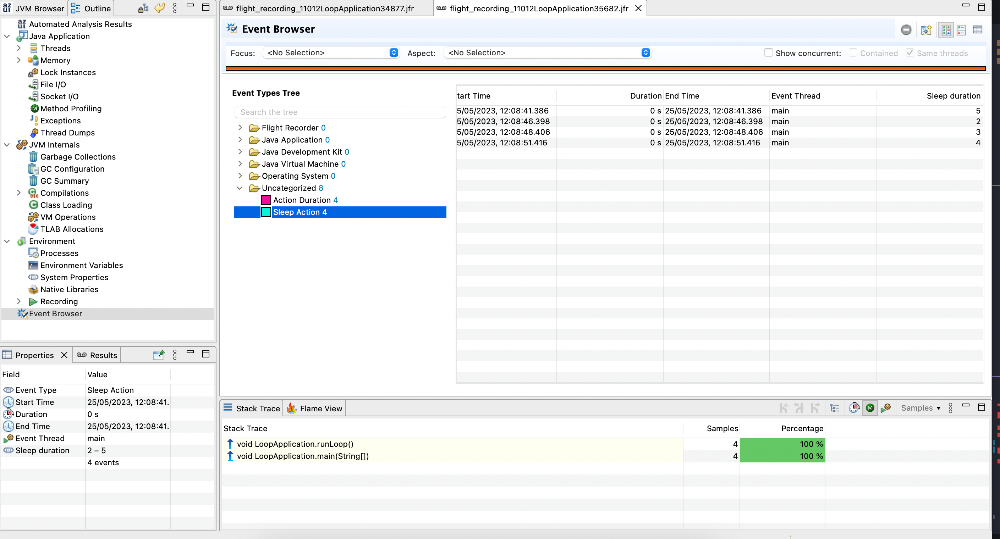

# Java Flight Recording Example

## Running

```shell
javac LoopApplication.java
java LoopApplication
```

## Inspecting the events

Use the [Azul Missipon Control](https://www.azul.com/products/components/azul-mission-control/). This is a fork of the JDK Mission Control, either applicaton works fine though.

The two custom events will be logged under `Uncategorized`:

